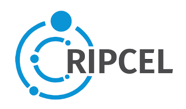

# OICE · Observatorio Iberoamericano de Comunidades Energéticas

<div align="center">
  
  &nbsp;&nbsp;&nbsp;&nbsp;
  
</div>

**OICE** es una plataforma científica abierta diseñada para el diagnóstico, implementación y estudio comparado de comunidades energéticas en 15 países de Iberoamérica. Es una iniciativa de la Red Temática **CYTED RIPCEL** (Red Iberoamericana de Promoción de Comunidades Energéticas Locales para la Transición Justa y Sostenible).

## 🌟 Características Principales

- **🌍 Atlas Interactivo**: Visualización geoespacial avanzada utilizando un globo terráqueo interactivo con estética "NASA night-lights". Permite explorar comunidades energéticas georeferenciadas y sus dimensiones técnicas y sociales.
- **📊 Taxonomía 4D de OICE**: Evaluación estandarizada de proyectos basada en cuatro dimensiones críticas:
  - **Tecnología**: Configuración y capacidad técnica.
  - **Gobernanza**: Modelos organizativos y principios de Ostrom.
  - **Regulación**: Marcos legales y brecha regulatoria (Regulatory Divide).
  - **Apropiación Social**: Niveles de emancipación y participación ciudadana.
- **⚖️ Monitor Legislativo**: Seguimiento en tiempo real de normativas, leyes y resoluciones sobre generación compartida y figuras asociativas en la región.
- **📚 Repositorio Académico**: Biblioteca científica integrada para la búsqueda y consulta de literatura especializada sobre comunidades energéticas y transición justa.
- **🤖 Asistente IA (RAG)**: Motor conversacional avanzado (en desarrollo) entrenado con el ecosistema documental de RIPCEL para consultas técnicas y regulatorias.

## 🛠️ Stack Tecnológico

- **Frontend**: React + Vite
- **Estilos**: Tailwind CSS con diseño editorial premium.
- **Visualización 3D**: `react-globe.gl` (Three.js)
- **Tipografía**: Instrument Serif (Headers) e Inter (UI/Body).
- **Internacionalización**: Sistema de i18n propio con soporte para Español e Inglés.

## 🚀 Instalación y Desarrollo Local

### Requisitos Previos
- Node.js (v18 o superior)
- npm o yarn

### Pasos
1. **Clonar el repositorio**:
   ```bash
   git clone https://github.com/gerardoblancopy/OICE.git
   cd OICE
   ```

2. **Instalar dependencias**:
   ```bash
   npm install
   ```

3. **Configurar variables de entorno**:
   Crea un archivo `.env` en la raíz (opcional para funciones de IA):
   ```env
   VITE_GEMINI_API_KEY=tu_clave_aqui
   ```

4. **Iniciar el servidor de desarrollo**:
   ```bash
   npm run dev
   ```

## 📜 Licencia

Este proyecto es parte de la iniciativa científica de la Red RIPCEL. Para consultas sobre el uso de los datos o colaboración académica, por favor refiérase a los términos de la red CYTED.

---

<div align="center">
  <sub>Desarrollado para la Transición Energética Justa en Iberoamérica.</sub>
</div>
